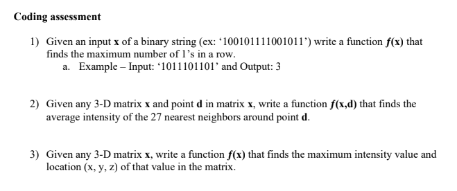

<h1>UPMC HW</h1>

I learned Python and NumPy to complete an assignment when interviewing for my current role at UPMC.

This is essentially my "Hello World" in Python.

This is an upgraded version of the "repo" from 2019.

<b>1) consec_ones</b>

<b>2) max_and_loc</b>

<b>3) avg_neighbors</b>

